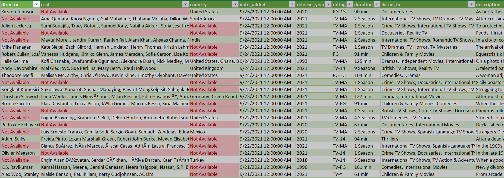
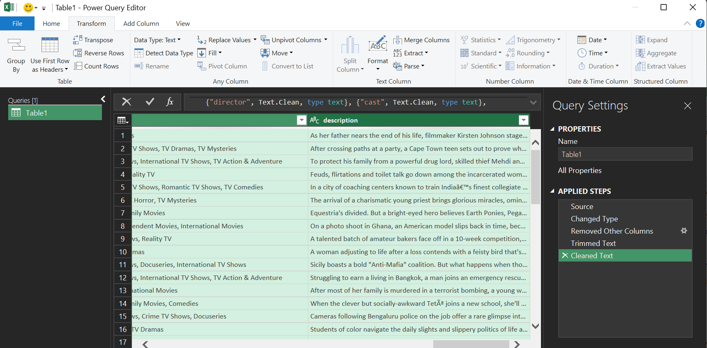
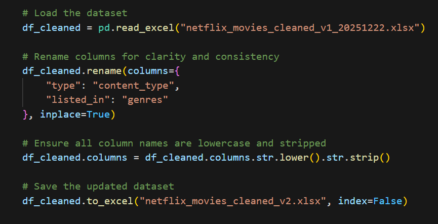
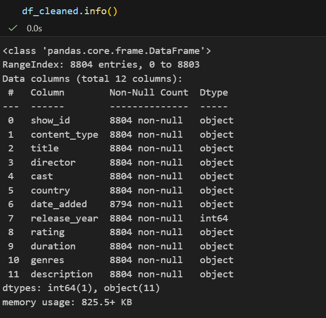

# Netflix Movies Data Cleaning Project

This repository documents the data cleaning and preparation process applied to the **Netflix Movies dataset**. The workflow follows a staged approach, starting with Excel-based cleaning and progressing to standardization and validation in a Jupyter Notebook. The goal is to ensure data quality, transparency, and reproducibility while preserving the integrity of the original dataset.

---

## Project Overview

* **Dataset:** Netflix Movies
* **Cleaning Tools:** Excel, Power Query, Jupyter Notebook (Python / pandas)
* **Approach:** Stepwise cleaning → standardization → validation
* **Note:** No external data enrichment was performed

---

## 1. Raw Data Inspection

The raw dataset was first inspected to understand its structure, identify missing values, and detect obvious data quality issues.

**Screenshot:** First 10 rows of the raw dataset

This inspection revealed missing values in several descriptive metadata columns, inconsistent text formatting, and column names that required standardization for analysis.

---

## 2. Excel-Based Cleaning

Initial cleaning was performed in Excel to correct missing values and improve text consistency while preserving all records.

### 2.1 Handling Missing Values

Missing values were identified primarily in descriptive columns (*director*, *cast*, *country*, *rating*, and *duration*). Explicit placeholders such as **"Not Available"** or **"Unrated"** were used to preserve records and maintain consistency. Missing values in the *date_added* column were left blank to avoid introducing temporal bias.

**Screenshot:** Missing values highlighted and replaced in Excel

---

### 2.2 Power Query Text Cleaning

Power Query was used to further prepare the dataset by trimming and cleaning text fields, correcting data types, and removing unnecessary columns. This step ensured consistent formatting prior to exporting the dataset for Python-based analysis.

**Screenshot:** Power Query transformations

---

### 2.3 Cleaned Excel Output

After completing Excel and Power Query cleaning, the dataset was saved as an intermediate cleaned version.

**Screenshot:** First 10 rows of the cleaned Excel dataset

---

## 3. Jupyter Notebook Standardization

The cleaned Excel dataset was imported into a Jupyter Notebook for column standardization and validation using Python.

### 3.1 Column Name Standardization

To improve clarity and compatibility with Python, column names were standardized:

* `type` → `content_type`
* `listed_in` → `genres`
* All column names converted to lowercase and stripped of extra spaces

**Screenshot:** Column renaming in Jupyter Notebook

---

## 4. Data Validation

After cleaning and standardization, the dataset was validated using pandas inspection methods to confirm data types, missing values, and summary statistics.

**Screenshot:** Dataset structure and data types (`df.info()`)

---

## 5. Cleaning Decisions Summary

| Step           | Area             | Action Taken                   | Reason                           |
| -------------- | ---------------- | ------------------------------ | -------------------------------- |
| Raw inspection | All columns      | Initial review                 | Identify data quality issues     |
| Missing values | Metadata columns | Used explicit placeholders     | Preserve records and consistency |
| Text cleaning  | Power Query      | Trimmed and cleaned text       | Improve formatting               |
| Column names   | Jupyter Notebook | Renamed and standardized       | Python compatibility             |
| Validation     | Jupyter Notebook | Used `info()` and `describe()` | Verify data quality              |
| External data  | All              | No enrichment performed        | Maintain reproducibility         |

---

## Methodological Note

This project distinguishes clearly between **data cleaning** and **data enrichment**. Only information present in the original dataset was used. External sources were intentionally excluded to preserve reproducibility, transparency, and analytical integrity.

---

## Output Files

* `netflix_movies_raw_20251219.xlsx`
* `netflix_movies_cleaned_v1_20251222.xlsx`
* `netflix_movies_cleaned_2_20251222.csv`

---
